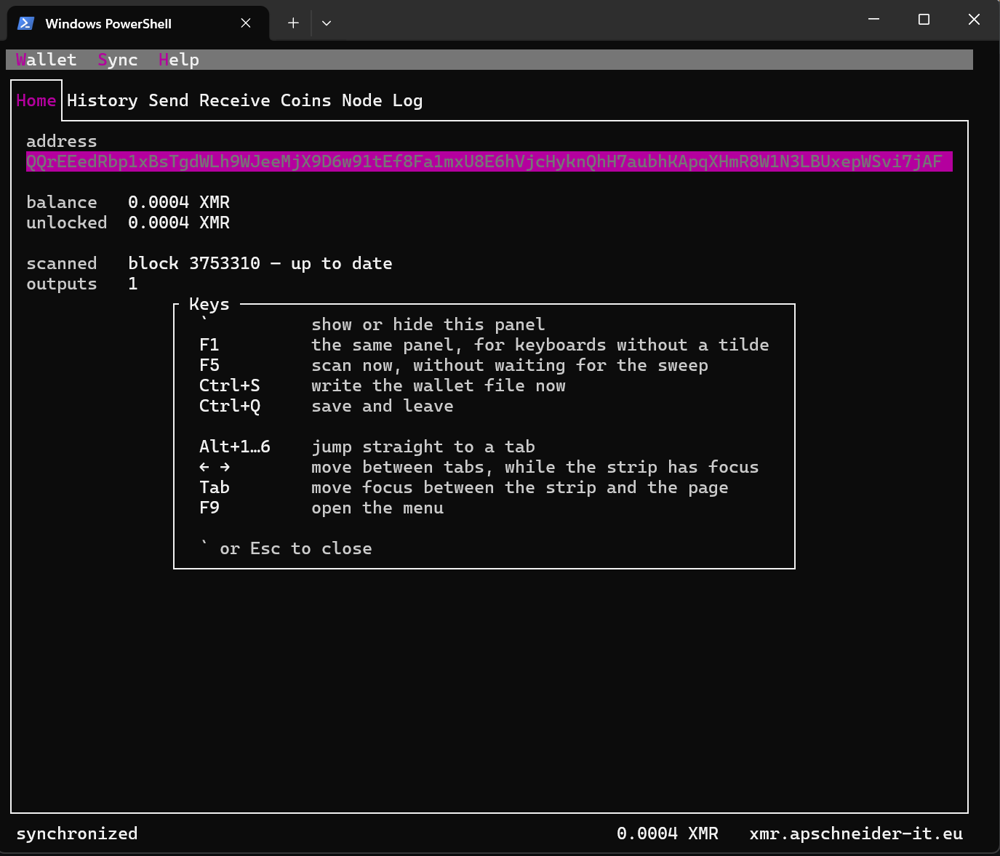

<p align="center">
  
</p>

<h1 align="center">moonlight</h1>

<p align="center">a Monero wallet in pure managed C#</p>

<p align="center">
  
  
  
  
  
</p>

No P/Invoke, no native binaries, no NuGet packages in the parts that hold keys — one artifact that runs wherever the runtime does, and every byte of it readable in this repository.

**Status: early.** Crypto, serialization, the daemon client, RingCT and a scanning wallet are in. The TUI syncs a wallet to the mainnet tip — pruned blocks, so the proofs a scan never reads are not fetched — and finds real payments to its own addresses. The CLSAG signatures and the Bulletproof+ range proof of a real transaction verify against this code, and it reads that transaction's change amount back. All of it is also a linkable library with a C interface, so a user interface in any language can drive the same wallet. What is missing is the other half of spending: decoy selection, fees and the transaction builder. Nothing here spends money yet.

## The solution

|   | project | what it is |
|---|---------|------------|
|  | [`src/`](src) | the sterile core — Ed25519, Keccak, serialization, RingCT, node, wallet |
|  | [`src/Core`](src/Core) | the sync engine and the open wallet — everything an application needs |
|  | [`src/Core.Abi`](src/Core.Abi) | the C interface, for a user interface written in anything |
|  | [`apps/Cli`](apps/Cli) | NativeAOT command line — create, restore, addresses, sync, balance |
|  | [`apps/Tui`](apps/Tui) | vendored Terminal.Gui v1 — tabs, receive with a QR, coins, node, log |
|  | [`apps/Gui.Demo`](apps/Gui.Demo) | showcase of the interface — packages allowed, wallet not wired up yet |
|  | [`tests/`](tests) | the 5945-line corpus and its harness |

<sub> sterile zone: 0 packages, 0 P/Invoke &nbsp;·&nbsp;  outside the purity gate</sub>

## Build

```sh
dotnet build Moonlight.slnx
dotnet test  Moonlight.slnx
dotnet publish apps/Cli -c Release      # NativeAOT
dotnet publish apps/Tui -c Release      # NativeAOT
pwsh tools/purity-gate.ps1
```

Targets net8.0, compiled as C# 14 — so SDK 10 is required to build, though nothing newer than .NET 8 is required to run. Everything is AOT-compatible with the trim and AOT analyzers on; `PublishAot` is set only on the two apps, so the ordinary build stays ordinary.

### With Nix

`flake.nix` builds the same two NativeAOT binaries hermetically — pinned SDKs, pinned NuGet, no network during the build.

```sh
nix build .#moonlight          # apps/Cli  -> result/bin/moonlight
nix build .#moonlight-tui      # apps/Tui  -> result/bin/moonlight-tui
nix run   .# -- version
nix flake check                # both apps, the test corpus, the purity gate
nix develop                    # SDK 10 + SDK 8 + pwsh, then build by hand
```

The dev shell carries no C toolchain on macOS: ILC calls `clang`, `dsymutil` and `strip` by name, and Nixpkgs' `strip` rejects the flags it passes, so Xcode's command line tools stay in front. The packages build hermetically on all three platforms regardless.

NuGet is locked in `nix/deps/*.json`. Only `tests/` pulls packages; the two apps pull none, so their locks are empty and have to stay that way. The ILCompiler is not an exception — it comes from the combined SDK, and listing it as well makes two inputs offer the same package to `configureNuget`, which links them with a bare `ln -s` and fails on the second. After changing a `PackageReference`, regenerate the matching lock (`.#moonlight-tui` for `tui.json`, `.#checks.<system>.tests` for `tests.json`):

```sh
$(nix build --no-link --print-out-paths .#moonlight.passthru.fetch-deps) "$PWD/nix/deps/cli.json"
```

## Layout

```
src/                 sterile: 0 packages, 0 P/Invoke
  Crypto.Ed25519     vendored ref10 field/group/scalar arithmetic
  Diagnostics        the log
  Crypto             Scalar, Point; Keccak (legacy pad), VarInt, view tags,
                     derivations, key images, CryptoNote signatures
  Serialization      transaction and block parsers, ids, Merkle root, Epee
  RingCT             Pedersen, ECDH, CLSAG, Bulletproofs+, MultiExp
  Node               monerod JSON-RPC; /getblocks.bin over Epee
  Wallet             keys, accounts, addresses, subaddresses, scanner,
                     restore heights, encrypted storage
  Core               the sync engine, the open wallet, amounts
  Core.Http          the socket: the engine driven over HttpClient
  Core.Abi           the C interface, exports only
apps/
  Cli                sterile
  Tui                sterile; vendored Terminal.Gui v1
  Gui.Demo           outside the gate — thin showcase, packages allowed
tests/               outside the gate
  vectors/           the corpus (8.3 MB)
media/               brand assets
work/                git-ignored scratch for donor clones
```

Applications reference `Core.Http` and nothing else. Following the chain is a state
machine in `Core` that does no I/O — it says what to send, the host sends it — so a
user interface written in any language can link the library and use its own
networking. Details in [docs/architecture.md](docs/architecture.md).

Layers depend downward only, and that rule has already moved two things: `VarInt` sits in `Crypto` because view tags need it, and `Scalar`/`Point` sit there too because they need Monero's additions to ref10. Key material never travels as `byte[]`: constructing a `Scalar` or a `Point` is the only place bytes are checked, so holding one means holding something the curve will accept.

## Purity

`src/`, `apps/Cli` and `apps/Tui` allow **0** `PackageReference`, **0** `DllImport`, and no native assets in the restore graph. The sterile tree restores fully offline.

Enforced twice, because a rule nothing checks is a preference:

1. `Directory.Build.targets` fails the build of any sterile project that declares a package.
2. `tools/purity-gate.ps1` scans the sources and the restore graph in CI, and refuses a `Vendor/` directory with no `VENDORED.md`.

`tests/` and `apps/Gui.Demo` are outside the gate on purpose. Nothing sterile references the demo. Details in [docs/purity-policy.md](docs/purity-policy.md).

## TUI

<p align="center">
  
</p>

Caught up to the mainnet tip, with a payment found — every byte of that scan done by the code in this repository.

`apps/Tui` vendors Terminal.Gui v1 from the SharpOS fork — the curated compile-in module, which has no ConsoleDrivers and therefore no P/Invoke, and replaces NStack with its own `Rune`. The wallet is meant to run on SharpOS eventually, so the kernel driver stays in the tree; `MoonlightHost` picks the input side.

|            | console (default)                           | sharpos                            |
|------------|---------------------------------------------|------------------------------------|
| size       | `Console.WindowWidth/Height`, COLUMNS/LINES | `AppConsole.TryGetSize`            |
| loop, keys | `ConsoleMainLoop`, `ConsoleKeyMap`          | `SharpOSMainLoop`, `SharpOSKeyMap` |

Rendering is shared: the driver writes ANSI through `Console.Write` on both.

## Tests

Vectors before code. The harness for monero's `tests/crypto/tests.txt` — kept here as [`tests/vectors/tests.txt`](tests/vectors/tests.txt) — was the first thing committed, so every crypto file since is born under the whole corpus.

|             |                                                                          |
|-------------|--------------------------------------------------------------------------|
| `tests.txt` | 5945 lines, 20 operations, from monero (BSD-3); 5539 replayed line by line |
| grammar     | transcribed from monero's reference runner; every line checked against it |
| generators  | 1013 of those lines record bytes drawn from monero's deterministic test generator; reproducing it makes our generators match byte for byte, draw pattern included |
| real data   | transaction ids of five real transactions; the Merkle root and block id of block 202612 |

Corpus tests assert the vector files themselves are intact — a truncated vector file is the one failure that makes every later test pass for free. Inventory, including what we do not have vectors for, in [docs/test-corpus.md](docs/test-corpus.md).

Point `MOONLIGHT_DAEMON` at a node and the chain tests run too: every block must parse to the last byte, every transaction must hash to the id the daemon listed.

## Donors

Steal what is stealable; port what is not. Every `Vendor/` tree carries a `VENDORED.md` with the upstream commit and a full list of local changes.

| donor                                   | licence                      | use                                            |
|-----------------------------------------|------------------------------|------------------------------------------------|
| MoneroRing                              | MIT                          | crypto layer — copied                          |
| ref10, through MoneroRing               | public domain (Chaos.NaCl, djb) | field, group and scalar arithmetic — copied |
| MoneroSharp                             | MIT                          | mnemonic, Base58, network prefixes — copied, nothing else |
| Terminal.Gui (SharpOS fork), XtermSharp, QRCoder | MIT                | the TUI — copied                               |
| monero-oxide                            | MIT (per crate, all checked) | Rust reference; BP+ transcript intermediates   |
| monero                                  | BSD-3                        | vectors copied; src/ringct ported by hand      |
| skunkworks, CantiLib, Determ            | GPL-3 / AGPL / undecided     | read only — never copied                       |

`work/` holds the clones; `pwsh tools/clone-donors.ps1` fetches them all.

## Docs

[architecture](docs/architecture.md) · [build modes](docs/build-modes.md) · [purity policy](docs/purity-policy.md) · [test corpus](docs/test-corpus.md) · [hard forks](docs/hardfork-policy.md) · [upstream bugs](docs/known-upstream-bugs.md) · [notices](THIRD-PARTY-NOTICES.md)

## Roadmap

1. ~~ref10 and the crypto layer, against `tests.txt`.~~
2. ~~Serialization: transactions, blocks, ids, Merkle root, Epee.~~
3. ~~Node: monerod JSON-RPC and `/getblocks.bin`.~~
4. ~~RingCT: Pedersen, ECDH, CLSAG, Bulletproofs+ both ways — verification checked against proofs monero made.~~ Pippenger for the multiexp remains.
5. ~~Wallet: seeds, addresses, subaddresses, scanner, balance, encrypted storage.~~ Decoys, fees and the transaction builder remain.
6. ~~One library the applications share, following the chain without owning the socket, offered to C as a linkable artifact.~~ Errors still cross the C boundary as a bare code with no message, and nothing in CI builds or runs the native artifacts.
7. Spending: decoy selection, fee and weight, the transaction builder.
8. Integration: stagenet end to end, plus our own verify-chain over real blocks.

---

<p align="center"></p>

<p align="center">MIT licensed.</p>
